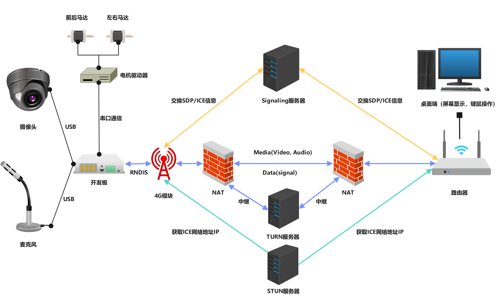
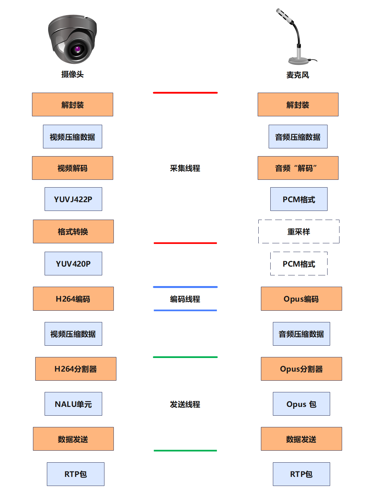
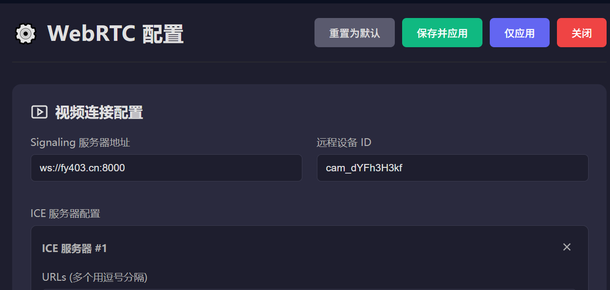
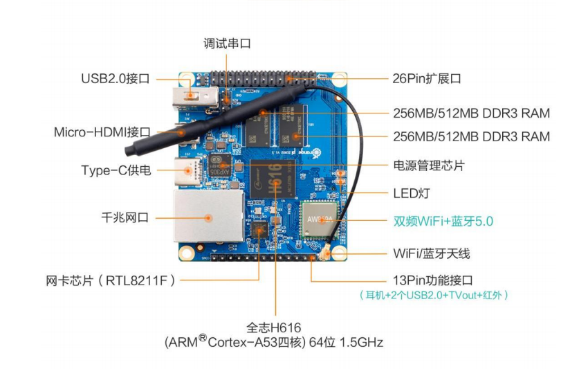
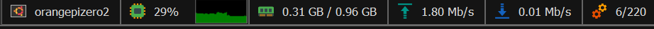
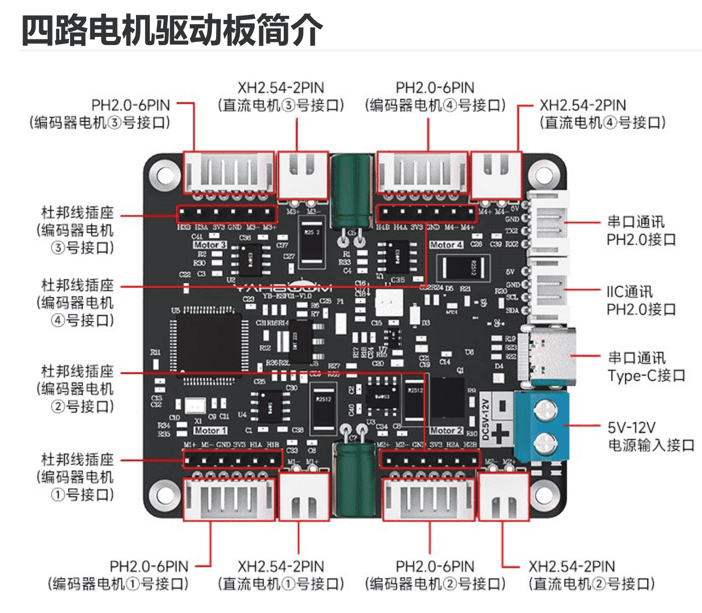
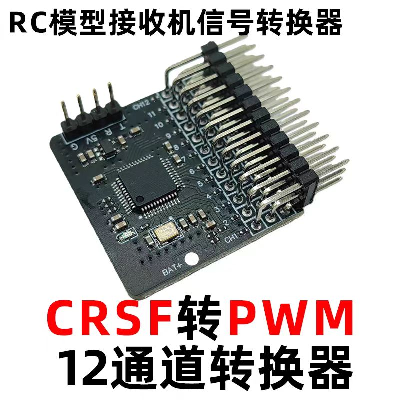
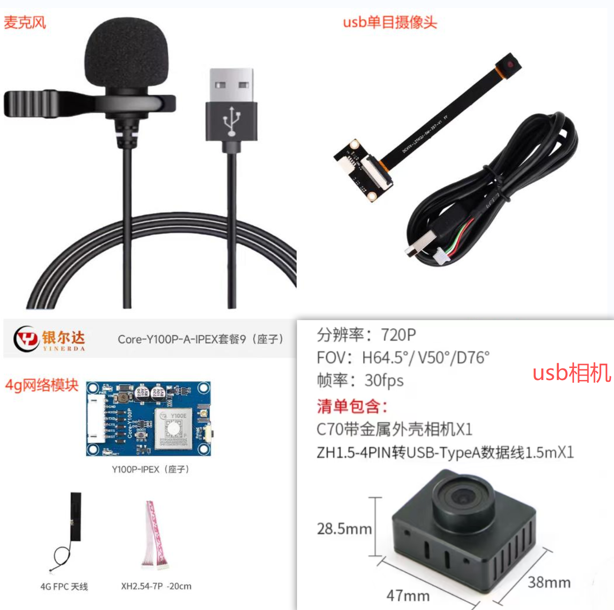

# 详细文档 · WebRTC 远程遥控车系统

> 本文档是 [README.md](README.md) 的详细补充，包含完整的部署步骤、硬件选型、技术细节与 Q&A。

---

## 目录

- [详细文档 · WebRTC 远程遥控车系统](#详细文档--webrtc-远程遥控车系统)
  - [目录](#目录)
  - [系统架构](#系统架构)
    - [连接建立流程](#连接建立流程)
    - [音视频数据流](#音视频数据流)
  - [快速开始](#快速开始)
    - [前置依赖说明](#前置依赖说明)
    - [Step 1：部署信令服务器](#step-1部署信令服务器)
    - [Step 2：配置 STUN / TURN 服务器](#step-2配置-stun--turn-服务器)
    - [Step 3：安装开发板依赖](#step-3安装开发板依赖)
    - [Step 4：查找设备参数](#step-4查找设备参数)
      - [4.1 摄像头参数获取](#41-摄像头参数获取)
      - [4.2 麦克风参数获取](#42-麦克风参数获取)
      - [4.3 扬声器参数获取](#43-扬声器参数获取)
      - [4.4 电机驱动器接口获取](#44-电机驱动器接口获取)
      - [4.5 4G 网络模块接口获取](#45-4g-网络模块接口获取)
    - [Step 5：编译 \& 配置](#step-5编译--配置)
      - [5.1 编译程序](#51-编译程序)
      - [5.2 配置音视频采集端（av\_track）](#52-配置音视频采集端av_track)
      - [5.3 配置控制信号端（data\_track）](#53-配置控制信号端data_track)
      - [5.4 电机控制参数（可选）](#54-电机控制参数可选)
      - [5.5 快速重置 CLIENT\_ID](#55-快速重置-client_id)
      - [5.6 查看所有可用参数](#56-查看所有可用参数)
    - [Step 6：启动服务](#step-6启动服务)
    - [Step 7：打开控制端网页](#step-7打开控制端网页)
  - [材料清单](#材料清单)
  - [硬件选型指南](#硬件选型指南)
    - [开发板](#开发板)
    - [电机驱动方案](#电机驱动方案)
    - [网络模块](#网络模块)
    - [摄像头模块](#摄像头模块)
    - [声音模块](#声音模块)
  - [项目 Q\&A](#项目-qa)
    - [Q1：如何添加自定义的电机驱动方案？](#q1如何添加自定义的电机驱动方案)
    - [Q2：必须购买所有配件吗？](#q2必须购买所有配件吗)
    - [Q3：图传延时能达到多少？](#q3图传延时能达到多少)
  - [后续计划](#后续计划)

---

## 系统架构



整套系统由三个核心部分组成：

**1. 信令服务器（Signaling Server）**  
负责 WebRTC 握手阶段的 SDP 与 ICE 候选地址交换，使用 WebSocket 通信。支持 Node.js 和 Python3 两种实现，带宽需求极低（70元/年的 2H2G 服务器即可支撑）。

**2. 音视频采集端（`av_track`）**  
运行在开发板上，通过 FFmpeg 采集摄像头（MJPEG/YUV）与麦克风数据，编码为 H.264 + Opus，经 libdatachannel 推送至控制端。

**3. 数据控制端（`data_track`）**  
负责接收浏览器的键盘控制帧，解析后通过串口驱动电机控制板（支持 UART 四路驱动 / CRSF-PWM 两种方案）。同时采集 GPS、陀螺仪、电量等遥测数据，通过 DataChannel 回传至控制端展示。

### 连接建立流程

```
控制端(浏览器)                信令服务器              开发板(被控端)
     │                          │                        │
     │──── WebSocket 连接 ──────►│◄──── WebSocket 连接 ───│
     │                          │                        │
     │◄─────────── SDP Offer / Answer 交换 ─────────────►│
     │◄─────────── ICE Candidate 交换 ──────────────────►│
     │                          │                        │
     │◄════════════ P2P RTP 直连（音视频 + 控制信号） ════►│
```

WebRTC ICE 优先建立 P2P 直连；若 NAT 穿透失败，自动回退至 TURN 中继，保障远端连通性。

可以参考 [WebRTC连接原理](https://blog.csdn.net/yanceyxin/article/details/149752514) 及 [腾讯TRTC: WebRTC是如何工作的](https://trtc.io/zh/blog/details/what-is-webrtc) 进一步了解。

### 音视频数据流



---

## 快速开始

### 前置依赖说明

| 组件 | 用途 | 备注 |
|------|------|------|
| 信令服务器 | SDP/ICE 交换 | 调试期可直接使用作者公共服务 |
| STUN 服务器 | 获取公网地址 | 使用 `stun.l.google.com:19302` 即可 |
| TURN 服务器 | NAT 穿透失败时中继 | 可自建或使用 Cloudflare 免费节点 |
| 开发板 | 运行采集/控制程序 | 任意支持 Linux + FFmpeg 的 ARM 板 |

---

### Step 1：部署信令服务器

> 💡 **跳过提示**：如果只是本地调试，可直接使用作者公共信令服务器 `fy403.cn:8000`，但必须为你的设备配置唯一的 `CLIENT_ID`，避免冲突。

```shell
git clone https://github.com/fy403/webrtc
```

**方式一：Node.js**

```shell
cd webrtc/signaling_server/nodejs
sudo apt install nodejs npm
npm install
chmod +x ./install && ./install
```

**方式二：Python3**

```shell
cd webrtc/signaling_server/python3
sudo apt install python3 python3-pip
pip3 install -r requirements.txt
chmod +x ./install && ./install
```

> 默认监听端口 **8000**，记得在服务器防火墙放行 `TCP:8000`。

---

### Step 2：配置 STUN / TURN 服务器

公共 STUN 直接使用即可：

```
stun.l.google.com:19302
```

TURN 服务器可选方案：
- **自建**：参考 [搭建私有 TURN 服务器](turn_server/README.md)
- **免费**：使用 [Cloudflare TURN](https://pidan.dev/20250722/webrtc-livekit-deploy-config-turn-server/)（延迟略高）

申请 Cloudflare TURN 后，通过其提供的 `curl` 命令获取 TURN server host、username 和 password 即可。

---

### Step 3：安装开发板依赖

> 💡 **推荐使用 Docker 镜像**，可跳过以下繁琐步骤，直接进入 [Step 6：启动服务](#step-6启动服务)。  
> ARM64 镜像下载：[百度网盘](https://pan.baidu.com/s/1KUMbif2980GnhZgIphmZ5g?pwd=fy43)（提取码：fy43）

**手动安装依赖（以 Ubuntu/ARM 为例）：**

```shell
# 基础工具链
sudo apt install -y g++ make dos2unix git libsdl2-dev libssl-dev
sudo apt-get install -y nlohmann-json3-dev

# FFmpeg（推荐 4.4.2 版本）
sudo apt-get install -y libavdevice-dev libavformat-dev libavcodec-dev \
    libavutil-dev libswscale-dev x264 libx264-dev ffmpeg
# 若版本不兼容报错，建议手动编译 ffmpeg==4.4.2
# 或将报错提交给 AI Agent 进行适配
```

```shell
# CMake 3.28.3（手动编译）
wget https://github.com/Kitware/CMake/releases/download/v3.28.3/cmake-3.28.3.tar.gz
tar -xzvf cmake-3.28.3.tar.gz && cd cmake-3.28.3
./configure && make -j3 && sudo make install
ln -sf /usr/local/bin/cmake /usr/bin/cmake
```

```shell
# libdatachannel（WebRTC 数据通道库）
git clone https://github.com/paullouisageneau/libdatachannel.git
cd libdatachannel && git submodule update --init --recursive
mkdir build && cd build && cmake .. && make -j2 && sudo make install
```

> 💡 ARM 开发板建议换用清华 apt 镜像源加速下载。  
> 也可通过 `git submodule update --init --recursive` 下载放在 `deps/` 目录下的依赖，在源码目录直接 `make` 编译。

---

### Step 4：查找设备参数

在运行程序前，需要确认各硬件设备的标识符。

#### 4.1 摄像头参数获取

```shell
# 列出所有视频设备
root@orangepizero2:~# sudo v4l2-ctl --list-device
cedrus (platform:cedrus):
        /dev/video0
SIT USB2.0 Camera RGB: SIT USB2 (usb-5200000.usb-1.2):
        /dev/video1   # 第一个摄像头
        /dev/video2

# 查看摄像头支持的格式/分辨率/帧率
root@orangepizero2:~# sudo v4l2-ctl -d /dev/video1 --list-formats-ext
ioctl: VIDIOC_ENUM_FMT
        Type: Video Capture
        [0]: 'MJPG' (Motion-JPEG, compressed)
                Size: Discrete 640x480
                        Interval: Discrete 0.033s (30.000 fps)
                Size: Discrete 1920x1080
                ......
```

#### 4.2 麦克风参数获取

```shell
root@orangepizero2:~# arecord -L
hw:CARD=Audio,DEV=0   # 第一个 USB 麦克风
    AB13X USB Audio, USB Audio

root@orangepizero2:~# arecord --device=hw:CARD=Audio,DEV=0 --dump-hw-params
FORMAT:  S16_LE       # 音频格式
CHANNELS: 1           # 通道数
RATE: 48000           # 采样率
```

#### 4.3 扬声器参数获取

```shell
root@orangepizero2:~# aplay -l
card 3: Device [USB2.0 Device], device 0: USB Audio [USB Audio]

root@orangepizero2:~# cat /proc/asound/card3/stream0
Playback:
  Format: S16_LE
  Channels: 2
  Rates: 48000
```

#### 4.4 电机驱动器接口获取

```shell
root@orangepizero2:~# ls /dev/ttyUSB*
/dev/ttyUSB0
```

#### 4.5 4G 网络模块接口获取

使用 RNDIS 的 4G 模块，通常第一个以 `enx` 开头的即为 4G 网卡。

```shell
root@orangepizero2:~# ip a
5: enx2089846a96ab: <BROADCAST,MULTICAST,UP,LOWER_UP> mtu 1500 ...
    inet 192.168.10.2/24 ...

root@orangepizero2:~# ip route
default via 192.168.10.1 dev enx2089846a96ab ...   # 4G 网卡优先上网

# 4G 模块 USB 调试串口（通常是第一个 ttyACM）
root@orangepizero2:~# ls /dev/ttyACM*
/dev/ttyACM0  /dev/ttyACM1  /dev/ttyACM2
```

> 如果没有 4G 模块，直接让开发板与电脑连接同一 WiFi 也可以控制。

---

### Step 5：编译 & 配置

#### 5.1 编译程序

```shell
git clone https://github.com/fy403/webrtc
cd webrtc

# 一键全量编译
./build-all.sh

# 或分模块编译
cd av_track   && chmod +x build.sh install.sh && ./build.sh
cd data_track && chmod +x build.sh install.sh && ./build.sh
```

#### 5.2 配置音视频采集端（av_track）

编辑 `av_track/config.txt` 配置文件（使用 `key=value` 格式，支持 `#` 注释）：

```ini
# =============================================================================
# Signaling Server Configuration (信令服务器配置)
# =============================================================================
webSocketServer=fy403.cn          # 信令服务器地址
webSocketPort=8000                # 信令服务器端口
client_id=usbcam                  # ⚠️ 必须全局唯一

# =============================================================================
# STUN/TURN Configuration (STUN/TURN服务器配置)
# =============================================================================
stunServer=stun.l.google.com      # STUN服务器地址
stunPort=19302                    # STUN服务器端口
turnServer=tx.fy403.cn            # TURN中继服务器地址（留空则禁用）
turnPort=3478                     # TURN服务器端口
turnUser=fy403                    # TURN服务器用户名
turnPass=qwertyuiop               # TURN服务器密码

# =============================================================================
# Video Configuration (视频配置)
# =============================================================================
videoDevice=/dev/video1            # 摄像头设备（主）
videoFormat=                       # 视频输入格式（留空则自动检测，如MJPG/YUYV）
videoCodec=h264                   # 视频编码格式：h264 或 h265
resolution=640x480                # 视频分辨率
framerate=30                      # 视频帧率

# =============================================================================
# Audio Input Configuration (音频输入配置)
# =============================================================================
audioDevice=hw:CARD=Audio,DEV=0  # 音频输入设备（留空则禁用音频采集）
audioFormat=S16_LE                # 音频输入格式
sampleRate=48000                  # 音频采样率
channels=1                        # 音频声道数：1=单声道，2=立体声

# =============================================================================
# Audio Output Configuration (音频输出配置)
# =============================================================================
speakerDevice=                    # 音频播放设备（留空则禁用音频播放）
outSampleRate=48000               # 音频输出采样率
outChannels=2                     # 音频输出声道数
volume=1.0                        # 音频输出音量（0.0~2.0）

# =============================================================================
# Debug Configuration (调试配置)
# =============================================================================
debug=false                       # 启用调试模式
```

#### 5.3 配置控制信号端（data_track）

编辑 `data_track/config.txt` 配置文件：

```ini
# =============================================================================
# Signaling Server Configuration (信令服务器配置)
# =============================================================================
webSocketServer=fy403.cn          # 信令服务器地址
webSocketPort=8000                # 信令服务器端口
client_id=dataTrack               # ⚠️ 必须全局唯一

# =============================================================================
# STUN/TURN Configuration (STUN/TURN服务器配置)
# =============================================================================
stunServer=stun.l.google.com      # STUN服务器地址
stunPort=19302                    # STUN服务器端口
turnServer=tx.fy403.cn            # TURN中继服务器地址
turnPort=3478                     # TURN服务器端口
turnUser=fy403                    # TURN服务器用户名
turnPass=qwertyuiop               # TURN服务器密码

# =============================================================================
# Motor Controller Configuration (电机控制器配置)
# =============================================================================
usbDevice=/dev/ttyUSB0            # 电机驱动板串口设备
ttyBaudrate=115200                # 串口波特率
motorDriverType=uart              # 电机驱动类型：uart 或 crsf

# =============================================================================
# GSM Module Configuration (4G模块配置)
# =============================================================================
gsmPort=/dev/ttyACM0              # 4G模块串口设备
gsmBaudrate=115200                # 4G模块波特率

# =============================================================================
# GPS Module Configuration (GPS模块配置) 必须支持NMEA协议
# =============================================================================
gpsPort=/dev/ttyUSB1              # GPS模块串口设备（可选）
gpsBaudrate=115200                # GPS模块波特率

# =============================================================================
# Restart Configuration (重启配置)
# =============================================================================
CHECK_INTERVAL=2                  # 健康检查间隔（秒）
```

#### 5.4 电机控制参数（可选）

如使用不同的电机驱动端口，修改 `data_track/include/constants.h`：

```cpp
const int MOTOR_FRONT_BACK = 2;       // 控制前后
const int MOTOR_LEFT_RIGHT = 4;       // 控制左右

const int16_t NEUTRAL_PWM      = 0;
const int16_t MAX_FORWARD_PWM  = 3500;
const int16_t MAX_REVERSE_PWM  = -3500;
```

#### 5.5 快速重置 CLIENT_ID

在项目根目录运行以下脚本，自动为两个模块生成随机唯一 ID 并更新 `config.txt` 文件：

```shell
#!/bin/bash
RANDOM_CAM=$(tr -dc 'a-zA-Z0-9' < /dev/urandom | head -c 8)
RANDOM_DATA=$(tr -dc 'a-zA-Z0-9' < /dev/urandom | head -c 8)

# 读取当前CLIENT_ID
DATA_CLIENT_ID=$(grep "^client_id=" data_track/config.txt | cut -d'=' -f2)
AV_CLIENT_ID=$(grep "^client_id=" av_track/config.txt | cut -d'=' -f2)

echo "将 $DATA_CLIENT_ID 替换为: data_id_${RANDOM_DATA}"
echo "将 $AV_CLIENT_ID 替换为: cam_id_${RANDOM_CAM}"

# 更新config.txt
sed -i "s/^client_id=$DATA_CLIENT_ID/client_id=data_id_${RANDOM_DATA}/" data_track/config.txt
sed -i "s/^client_id=$AV_CLIENT_ID/client_id=cam_id_${RANDOM_CAM}/" av_track/config.txt

# 更新其他引用了该ID的文件
DIRS=("av_track" "data_track")
for dir in "${DIRS[@]}"; do
    if [ -d "$dir" ]; then
        find "$dir" -type f ! -path "*/.git/*" \
            -exec grep -l -e "$AV_CLIENT_ID" -e "$DATA_CLIENT_ID" {} \; | while read file; do
            sed -i -e "s/$AV_CLIENT_ID/cam_id_${RANDOM_CAM}/g" \
                   -e "s/$DATA_CLIENT_ID/data_id_${RANDOM_DATA}/g" "$file"
            echo "已处理: $file"
        done
    fi
done
```

#### 5.6 查看所有可用参数

```shell
cd av_track/build && ./webrtc_publisher -h
```

---

### Step 6：启动服务

**方式一：直接运行（使用 config.txt 配置）**

```shell
# 音视频采集端
cd av_track/build
./webrtc_publisher ../config.txt

# 控制信号端
cd data_track/build
./webrtc_publisher ../config.txt
```

**方式二：使用安装脚本（自动读取 config.txt）**

```shell
# 音视频采集端
cd av_track && ./install

# 控制信号端
cd data_track && ./install
```

**方式三：Docker 一键运行**

```shell
# 配置 Docker 开机自启
sudo systemctl enable docker

# 下载 ARM64 镜像
docker pull alifys/ubuntu:arm64

# 在根目录构建
./build-all.sh

# 运行 av_track（必须指定配置文件）
cd av_track && ./run-docker.sh config.txt

# 运行 data_track（必须指定配置文件）
cd data_track && ./run-docker.sh config.txt
```

---

### Step 7：打开控制端网页

用浏览器打开 [`data_track/web/index.html`](data_track/web/index.html)，或访问[在线体验](http://car.fy403.cn/)。



点击右上角 ⚙️ 齿轮图标可修改信令服务器地址和 STUN/TURN 配置，所有参数持久化到 Cookie。

等待画面和信号连接正常后即可操控：

| 操作 | 功能 |
|------|------|
| `W / S` | 前进 / 后退 |
| `A / D` | 左转 / 右转 |
| `空格` | 急停 |
| `Q` | 重启开发板信号服务 |
| 右上角 ⚙️ | 修改信令/STUN/TURN 服务器配置 |

如果自定义了 `CLIENT_ID`，需在配置页修改后点击 **Connect** 重新建立 P2P 连接。

---

## 材料清单

| 名称 | 参考价格 | 选购建议 |
|------|----------|----------|
| 开发板（如 OrangePi Zero2） | ¥125 | **优先选带 GPU 编解码的型号**，并确认有完善的驱动文档 |
| 四路电机驱动器 | ¥40 | 注意是否支持板载 5V BEC 稳压为开发板供电 |
| USB 摄像头 | ¥40 | 选免驱 USB 摄像头；进阶可选 MIPI CSI（低延时首选） |
| 4G 网络模块 | ¥20 | 优先选支持 RNDIS 的模块，即插即用 |
| RC 遥控车 | ¥160 | 选方便改造的型号，预留安装空间 |
| 7.4V 锂电池 | ¥10 | 选大容量，注意尺寸 |
| USB 扩展线 | ¥12 | 选模块化设计，便于布线 |
| 杜邦线若干 | ¥20 | 备用连接线 |
| **合计** | **≈¥427** | — |

---

## 硬件选型指南

### 开发板



优先选择**带 GPU 硬件编解码**的开发板（如搭载 Mali-G31 或 VPU 的型号），可大幅降低 CPU 占用：

- 当前软编码性能参考（4核1G，如 OrangePi Zero2）：CPU 平均占用 ~20%，内存 ~300MB，码率 ~800kbps，延时 ~110ms
- 摄像头输入格式建议选 `MJPEG`，避免使用 `YUYV422`（解压消耗 CPU 较大）



### 电机驱动方案

**方案一：UART 四路驱动板**（适合从零搭建，支持后续智能化扩展）



选购时注意驱动板的 BEC 供电能力是否能带动开发板；若开发板功耗较大，建议外接独立降压模块或单独电池供电。该驱动板还支持编码电机，后续升级方便。

配置方式：

```shell
MOTOR_DRIVER_TYPE=uart
```

**方案二：CRSF-PWM 转换器**（RC 遥控车无损改造首选）

直接替换原遥控接收机，完全不改动车辆原有线路。



参考资料：[RC 遥控车基础电子设备 - 知乎](https://zhuanlan.zhihu.com/p/671434192)

配置方式：

```shell
MOTOR_DRIVER_TYPE=crsf
```

如需调整舵机/电调参数，修改 `data_track/include/motor_controller_config.h`：

```cpp
// 舵机参数（控制方向）
uint16_t crsf_servo_min_pulse     = 500;   // 最小脉冲宽度（μs）
uint16_t crsf_servo_max_pulse     = 2500;  // 最大脉冲宽度（μs）
uint16_t crsf_servo_neutral_pulse = 1500;  // 中位脉冲宽度（μs）
uint8_t  crsf_servo_channel       = 2;     // CRSF 通道编号

// 电调参数（控制前后）
uint16_t crsf_esc_min_pulse       = 900;
uint16_t crsf_esc_max_pulse       = 2100;
uint16_t crsf_esc_neutral_pulse   = 1500;
bool     crsf_esc_reversible      = true;
uint8_t  crsf_esc_channel         = 1;
```

### 网络模块

| 方案 | 说明 | 推荐度 |
|------|------|--------|
| RNDIS 4G 模块 | 即插即用，识别为网卡，无需额外配置；建议 7.4V 供电，5V 会影响信号速率 | ⭐⭐⭐ |
| USB WiFi 网卡 | 轻量、低成本，适合室内固定场景 | ⭐⭐ |
| 板载 WiFi | 开箱即用，无额外成本 | ⭐⭐ |



### 摄像头模块

| 方案 | 带宽 | 优点 | 局限 |
|------|------|------|------|
| USB 摄像头（MJPEG） | USB 2.0，480Mbps | 免驱，通用性强 | 带宽有限，高分辨率受限 |
| MIPI CSI 摄像头 | 远超 USB | 低功耗、低延时、大带宽 | 需确认开发板接口兼容性 |

> 推荐 **MIPI CSI**，通常配合开发板自带硬件编解码，延时表现最佳。购买前务必确认开发板带有 CSI 接口且与摄像头兼容。

### 声音模块

麦克风根据开发板接口选择，优先选带降噪功能的。扬声器推荐 USB 接口，扩展性好，只要能定位到具体设备参数即可。

---

## 项目 Q&A

### Q1：如何添加自定义的电机驱动方案？

可使用 AI Agent（CodeBuddy / Cursor / Lingma）以 Agent 模式完成，输入如下提示词（替换 `<your_method>`）：

```
假如你是本项目的 C++ 开发工程师，帮我添加一个新的 motor_driver：(<your_method>)。
你可以查看已有的驱动编写模板：@include/uart_motor_driver.h @include/motor_driver.h。
驱动编写完成后，将其加入到 @src/MotorController 的构造函数中。
```

例如，使用 GPIO PWM 控制电调：

```
假如你是本项目的 C++ 开发工程师，需要新增一个电机驱动模块。
该模块通过 GPIO 引脚 22 输出 PWM 信号控制电调，工作频率 50Hz（周期 20ms）。

电调初始化流程：
1. 发送中立位脉冲（1500μs），使舵机归中；
2. 保持该信号 2 秒，完成电调校准（校准成功后会发出滴滴提示音）；
3. 校准完成后，控制量程为 900μs ~ 2100μs（以 1500μs 为零点）。

参考接口定义：@include/motor_driver.h
参考示例实现：@include/uart_motor_driver.h

驱动完成后，请集成到 @src/MotorController 构造函数，确保与现有系统兼容。
```

### Q2：必须购买所有配件吗？

不需要。系统高度模块化，可按需选配：

- **只需图传**：单独运行 `av_track`，不需要数据控制部分
- **只需远程控制**：单独运行 `data_track`，不需要摄像头
- **开发板选择**：只要能运行 Linux + FFmpeg + C++ 即可，支持任意架构
- **电机驱动**：UART 和 CRSF 两种方案均支持高度扩展

### Q3：图传延时能达到多少？

当前实测（内网 + 纯软编码）：

| 场景 | 延时 |
|------|------|
| 内网，软编码（4核1G 开发板） | ~110ms |
| 内网，硬件编解码加速 | 理论可 <100ms |
| 4G 广域网 | 受网络波动影响，通常 150~300ms |

> 使用 MJPEG 输入格式可显著降低采集端 CPU 压力，有助于进一步降低延时。

---

## 后续计划

- [x] 控制端语音推送
- [x] 被控端扬声器播放
- [x] H.265 编码支持
- [x] 多控制端并行接入
- [x] 配置信息持久化
- [x] 多通道绑定
- [ ] GNSS 定位 + 惯性导航（IMU）
- [ ] 电子陀螺仪稳像
- [ ] 无线充电支持
- [ ] 硬件视频编码芯片接入
- [ ] 编码器电机闭环控制
- [ ] AI 模型接入（目标识别 / 自主避障）
