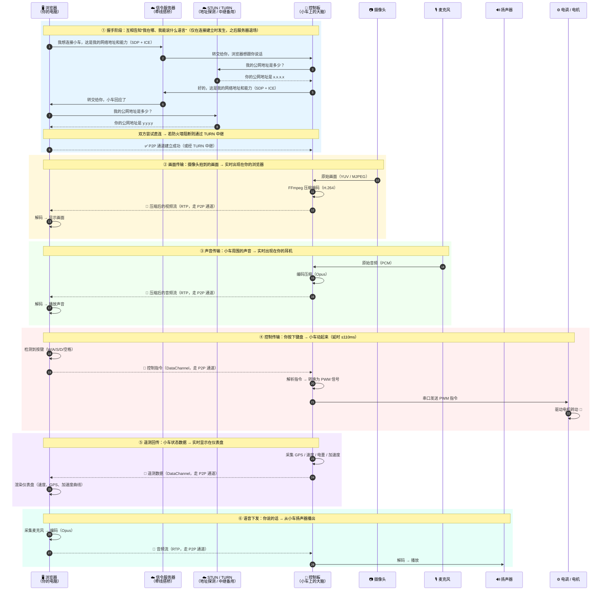
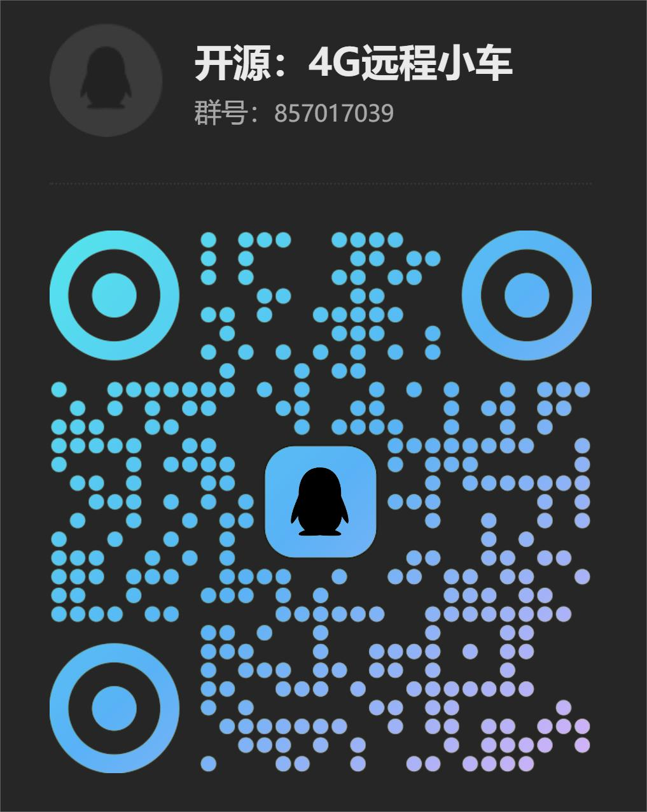

# 面向低延时，点对点、远程音视频与信号控制的远距离遥控车系统

  


### ⌛欢迎star✨任何问题发issue👨‍🏫欢迎一起贡献代码🎊[源码地址](https://github.com/fy403/webrtc)

## 项目初衷

本项目是一个个人学习性质的开源项目，旨在系统学习和实践音视频开发相关知识，并结合实际编程语言提高动手能力。在整个系统设计与实现过程中，注重代码的可扩展性，每个功能模块都尽量以独立函数库的形式呈现，便于后续复用与拓展。同时，在代码实现上追求简洁清晰，剔除冗余逻辑，专注于保留最核心、最本质的实现内容，帮助理解底层原理。

## 项目介绍

项目主要面向RC遥控车改造，希望在遥控车基础上开发低延时、点对点、可远程控制、可捕获画面和声音的遥控车。采用的技术方案是通过RTP将采集的音视频或者是监控数据传输到控制端；将控制信号也通过RTP传输到被控遥控车，遥控车通过解析协议，转换为命令控制遥控车。技术方案尽可能减少服务器的参与，流量直接点对点传输。

## 数据流动示意

> 下图展示了从"你按下键盘"到"小车动起来"、从"摄像头拍到画面"到"浏览器显示"的完整数据流动过程。
> 服务器只在**建立连接时**短暂参与，连接建立后画面和控制信号均**直接点对点传输**，服务器不再转发任何流媒体数据。



## 演示效果

屏幕OSD信息；数据通道实时数据变化；连接状态情况；实时视频参数调整；加速度曲线；GPS定位；速度仪表盘；共享连接数。

[在线体验地址](http://car.fy403.cn/)
[B站视频](https://www.bilibili.com/video/BV1VA1kBnEAx?share_source=copy_web)

## 快速运行

> 💡 详细部署步骤、硬件选型、设备参数获取方法请查阅 [详细文档](README-Detail.md)

### 1. 服务器部分

#### 1.1 信令服务器（调试时可用作者搭建的，默认已包含在配置中）

信令服务器负责协助 WebRTC 双方交换 SDP 和 ICE 信息。支持 4G 远程只需一台有公网 IP 的轻量服务器（约70元/年），带宽要求极低。

```shell
git clone https://github.com/fy403/webrtc
```

方法1：nodejs

```shell
cd webrtc/signaling_server/nodejs
sudo apt install nodejs npm
npm install
chmod +x ./install && ./install
```

方法2：python3

```shell
cd webrtc/signaling_server/python3
sudo apt install python3 python3-pip
pip3 install -r requirements.txt
chmod +x ./install && ./install
```

> 默认端口是8000，记得在服务器防火墙放行 TCP:8000。
> 如果 `fy403.cn:8000` 还能用，可直接使用，但必须配置唯一的 `CLIENT_ID="cam_id_YvgpEqD4"`，避免冲突。

#### 1.2 STUN/TURN 服务器（调试时可用作者搭建的，默认已包含在配置中）

STUN/TURN 服务器用于获取 WebRTC 双方的网络地址信息。公开 STUN 服务器直接使用即可，如 `stun.l.google.com:19302`。

TURN 服务器可自建（参考 [搭建私有TURN服务器](turn_server/README.md)），也可使用 Cloudflare 免费提供的节点（延迟稍高）。

#### 1.3 控制板部分（Docker 一键安装）

> 详细细节请查看 [Detail](README-Detail.md)

### 2. 安装启动

```shell
# 配置开机启动 Docker
sudo systemctl enable docker
# 从dockerhub拉取镜像
docker pull alifys/ubuntu:arm64
```

```shell
# 1. 使用根目录构建
./build-all.sh

# 2. 运行 av_track
pushd av_track
./run-docker.sh
# 或使用自定义参数
./run-docker.sh  config.txt

# 3. 运行 data_track
popd
pushd data_track
./run-docker.sh
# 或使用自定义串口
./run-docker.sh config.txt
popd
```

## 后续计划

- [x] 控制端语音推送
- [x] 被控端扬声器播放
- [x] X265编码
- [x] 多控制端并行
- [x] 配置信息持久化
- [x] 多通道绑定
- [ ] GNSS定位+带惯导
- [ ] 电子陀螺仪
- [ ] 无线充电
- [ ] 视频编码芯片支持
- [ ] 编码器电机支持
- [ ] AI模型接入

## QQ群交流


